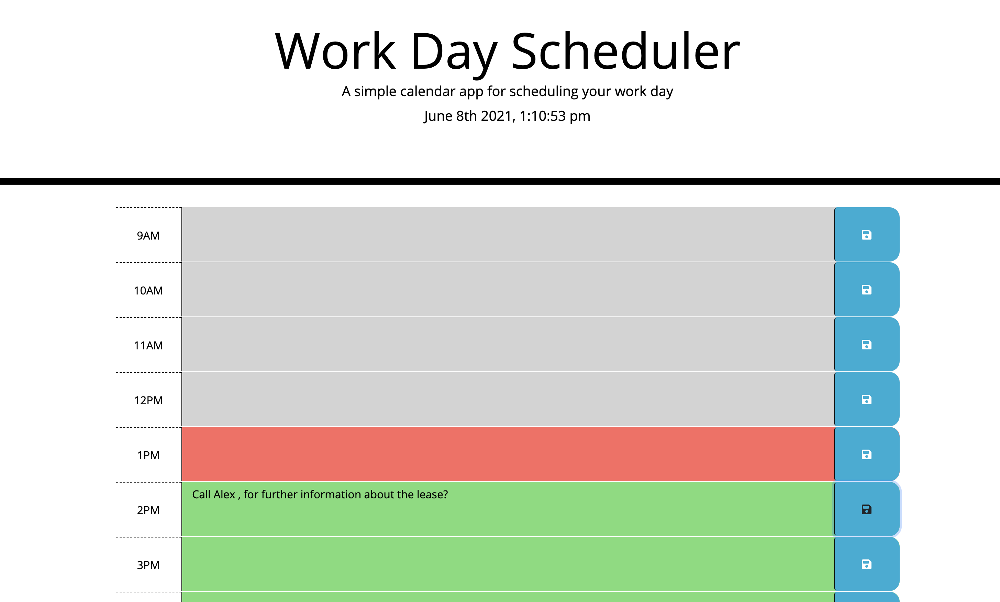
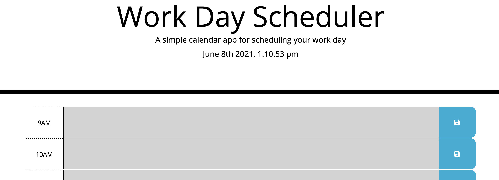

# day-planner

## Deployed Application: https://banuayozturk.github.io/day-planner/
## Description: 

In this project I worked on a day-planner which I can save daily events in time-blocks. User can detect upcoming, past and present events easily because time-blocks are color-coded. Also current day and current hour is displayed at the top of the calender.

With this project, I aimed to learn and apply Jquery  and Bootstrap. I might say that experiencing the advantages of the third part apis have been educative.

## Screenshot

## Credits/Libraries
 [w3schools bootstrap tutorials](https://www.w3schools.com/bootstrap/)

 [w3schools jquery tutorials](https://www.w3schools.com/jquery/)
 
 [stackoverflow - Setting Local Storage](https://stackoverflow.com/questions/40791207/setting-and-getting-localstorage-with-jquery)
 

## Contact Me
For any question about the project, please contact me.
[BanuAyozturk](mailto:bnyksl@gmail.com)
